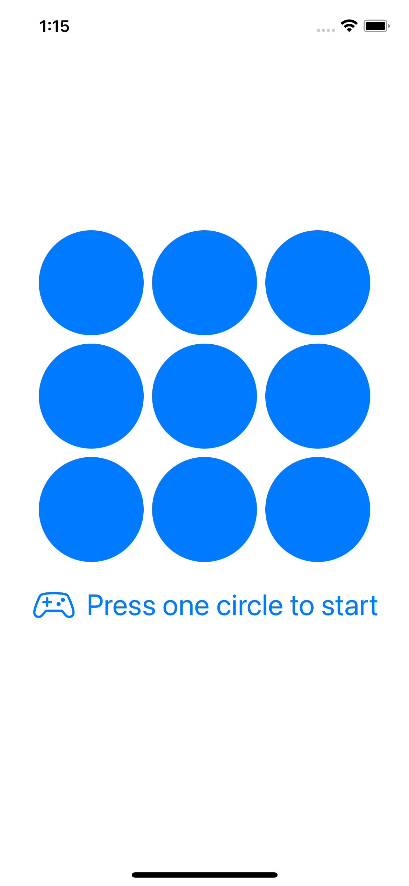

# TicTacToe (TDD-KATA)

This project is a KATA developed using Test Driven Development (TDD) techniques and some learnings from Domain Driven Design (DDD). It consists of a Tic Tac Toe game implemented in Swift, with a visual interface in SwiftUI, as well as a simple UIKit implementation for iOS.

## How to play TicTacToe
 The rules of the game are as follows: player X goes first and players alternate placing X's and O's on the board until either a player gets three in a row horizontally, vertically, or diagonally, or all nine squares are filled. If a player gets three in a row, they win. If all squares are filled and no one has won, it is a draw.

## How to use
To use the interface, simply build and run the project in Xcode. You can then play the game by tapping on the tiles on the board to place your moves. The game will automatically switch between players and display a message when the game is won or ends in a draw.

To reset the game, you can tap the reset button at the bottom of the screen.

<p align="center">



</p>

<p align="center">


</p>

## Approach to Solving the Problem
The approach to solving this problem was to first implement the game engine using TDD. This allowed for a clear separation of concerns and a solid foundation for the visual interface of the game.

Next, the SwiftUI version of the game was implemented, using the game engine as a reference. Many corrections were made to the original code provided by OpenAI to ensure that the game functioned correctly and met the requirements of the KATA.

Finally, a simple but functional UIKit version of the game was implemented, using TDD via XCTest to ensure that the game was playable and met the requirements of the KATA.

Overall, the focus was on producing the best code possible while experimenting with new technologies and following a logical approach to solving the problem.

## How to Compile and Run the Code

To compile and run the code, you will need to have the latest version of Xcode installed on your machine.

1. Clone the repository and move inside:

```
git clone https://github.com/2022-DEV2-014/TicTacToe.git
cd TicTacToe
```

2. Open the project in Xcode:
   
```
 open TicTacToe.xcodeproj
```

3. Select the target for the desired implementation
   
   - **TicTacToeApp** for SwiftUI
   - **TicTacToeUIKit** for UIKit

Press the Run button (**⌘R**) to build and run the app in the simulator

## Dependencies

This project has no external dependencies.

## Project Structure

### Schemas

**All Tests** links all the tests and runs them together, useful for automation of the deployment process.

**TicTacToe** contains all game rules and was developed using TDD. Compatible with **macOS** and **iOS**

**TicTacToeApp**: SwiftUI implementation assisted by OpenAI, but with many corrections. Compatible with **macOS** and **iOS**

**TIcTacToeUIKit**: UIKit implementation developed using TDD via XCTest and is fully playable, although its appearance is less polished than the SwiftUI version. Compatible with **iOS**

## Final considerations

I hope you enjoy the game and the implementation. If you have any questions or suggestions, please don't hesitate to contact me. The email in the commits will redirect to my real one :)

## Credits
This readme and the SwiftUI version were created by an anonymous contributor with assistance from OpenAI.
The logo was created using https://lexica.art/aperture